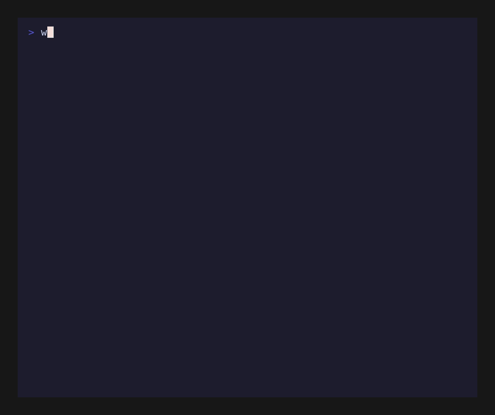

# anywhich

A `which` that finds what is installed on your system, even when it is not on `$PATH`. The command you type is `anyw`.

`which` stops at `$PATH` and only shows the first hit. On a machine with more than one package manager, a binary can be installed and still come back empty. `anyw` walks all of `$PATH`, shows every match in order, and tells you which one runs.



Linux works today, with resolvers for pacman, apt, dnf, zypper, apk, xbps, Flatpak, Snap, Nix, npm -g, deno, uv, pnpm, bun, cargo install, go install, and pipx. Windows lookups follow PATHEXT (`.exe`, `.bat`, `.cmd`); the Scoop, Chocolatey, and WinGet resolvers are fixture-tested only. macOS is untested.

Windows binaries are cross-compiled on CI and attached to each GitHub release: `anyw.exe` for x64 Windows, no Visual Studio or MinGW needed on the installing machine. Linux builds ship as a tarball the same way.

## Usage

```
$ anyw bat

PATH:
  1. /usr/bin/bat -> pacman: bat 0.25.0-1 (active)
  2. /home/rokuroo/.cargo/bin/bat -> cargo: bat 0.24.0

Currently resolves to: /usr/bin/bat (pacman: bat 0.25.0-1)
```

Not found:

```
$ anyw foobar

No matches in PATH.
foobar is not installed via any known source.
```

Exit code is 1 when nothing matches, so it works in scripts.

## Flags

- `--plain`: no color, scriptable output.
- `--why`: one reason line under each PATH entry explaining why it ranked there.

## Building

```
cargo build --release
```

The binary lands at `target/release/anyw`. Run the tests with `cargo test`.

Releases: push a tag (`git tag v0.2.0 && git push origin v0.2.0`) and the release workflow builds both platforms and attaches the binaries to the GitHub release. The tag must match the version in `Cargo.toml` — the workflow checks and fails the run otherwise.

## License

Dual-licensed under MIT or Apache-2.0.
